## Examen 1    
## Crear repositorio y carpeta para capturas  
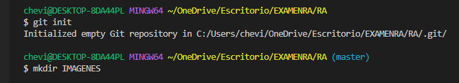
## Agregar al repositorio y crear README  
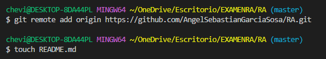
## Commit inicial  
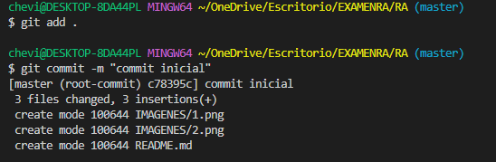
## Push inicial  
1. Para esto se debe escribir el comando "git push origin master" y ejecutarlo.
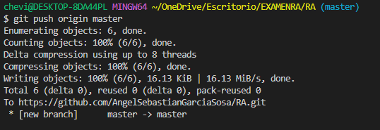
2. Ahora comprobaremos que el repositorio remoto si tenga los cambios.
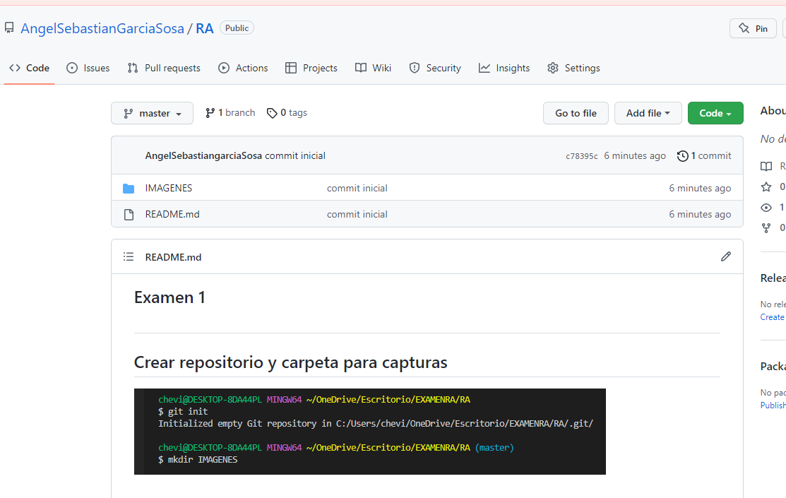
## Ignorar archivos  
1. Crear en el repositorio local un archivo llamado privado.txt.
2. Crear en el repositorio local una carpeta llamada privada. 
## Usando los siguientes comandos.
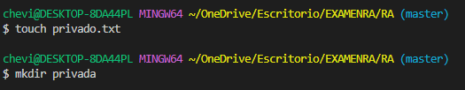
3. Realizar los cambios oportunos para que tanto el archivo como la carpeta sean ignorados por git. 
## Para esto crearemos el archivo .gitignore
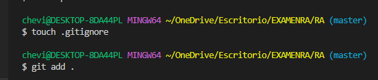
## Para esto escribiremos lo siguiente en el archivo .gitignore
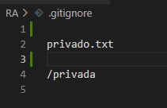
## Ahora veremos en el status para revisar que funciono
1. Aqui se puede ver que una vez modificado el archivo el unico que detecto fue el README

## Añadir Archivo 1.txt al repositorio local
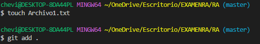
## Crear tag v0.1
1. Crear un Tag v0.1
2. Para esto se utiliza el siguiente comando. git tag -a v0.1 -m "tag v0.1"
3. Y se comprueba escribiendo git tag
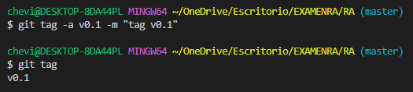
## Subir el tag  
1. Subir los cambios al repositorio remoto.

2. Podemos ir a gitgub para revisar que este agregado el tag.
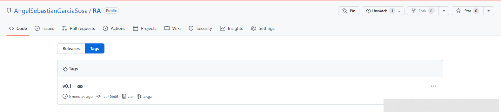
## Crear una rama v0.2
1. Crear una rama v0.2.
   
2. Posiciona tu working directory en esta rama. 
   
## Añadir Archivo 2.txt
1. Añadir un fichero 2.txt en la rama v0.2. 

## Crear una rama remota v0.2
1. Subir los cambios al repositorio remoto. 
## Hay que usar los siguientes comandos.
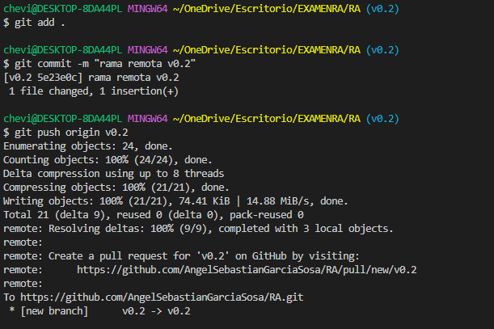
## Comprobacion  
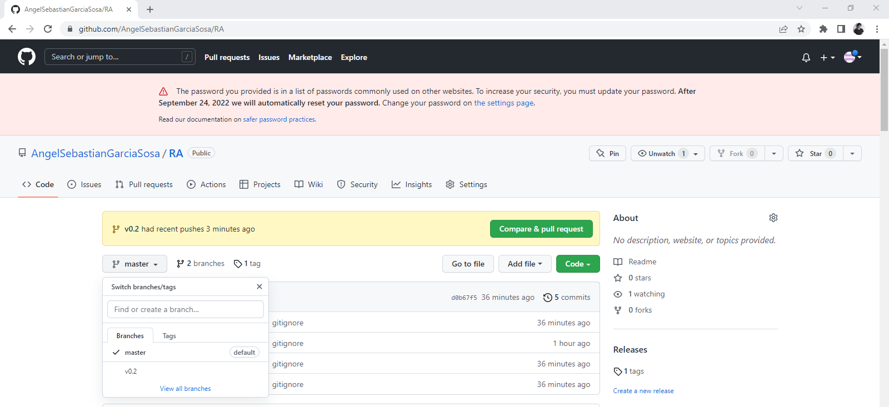
## Merge Directo  
1. Posicionarse en la rama master. 
2. Hacer un merge de la rama v0.2 en la rama master. 
## Usaremos los siguientes comandos:
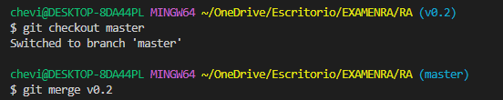
## Tendremos un error pero es normal.  
## Merge con conflicto  
1. En la rama master poner "Hola" en el fichero Archivo1.txt y hacer commit usando los siguientes comandos. 
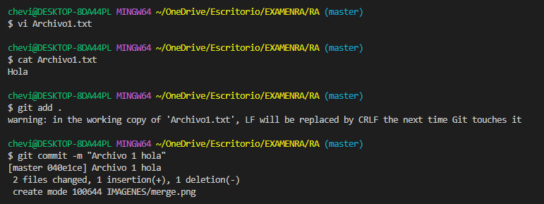
2. Posicionarse en la rama v0.2 y poner Adios en el archivo "Archivo1.txt" y hacer commit usando estos comandos. 
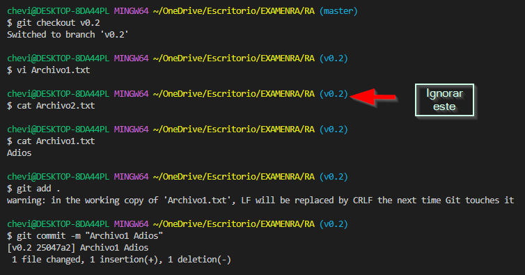
3. Posicionarse de nuevo en la rama master y hacer un merge con la rama v0.2 , usar estos comandos:
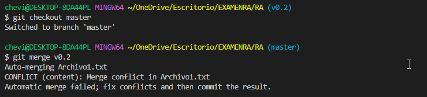
## Listado de Ramas  
1. Listar las ramas con merge y las ramas sin merge, usar estos comandos: 
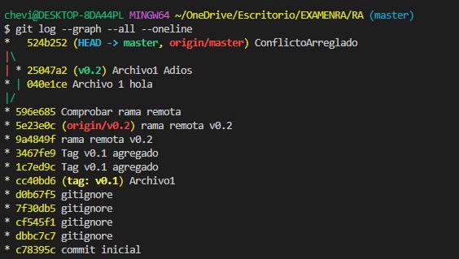
## Arreglar conflicto  
1. Arreglar el conflicto anterior y hacer un commit. 
## En este paso deberia marcar un error pero como ya habia hecho antes un add y un commit este se arreglo.

1. Para arreglar el conflicto hay que hacer un add y un commit y debe aparecer lo siguiente.
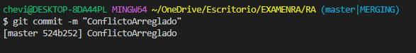
## Borrar rama  
1. Crear un tag v0.2 con este comando.

2. Borrar la rama v0.2 con este comando: 

## Listado de cambios  
1. Listar los distintos commits con sus ramas y sus tags. 
2. Acontinuacion se muestra el listado de cambios usando este comando: git log.
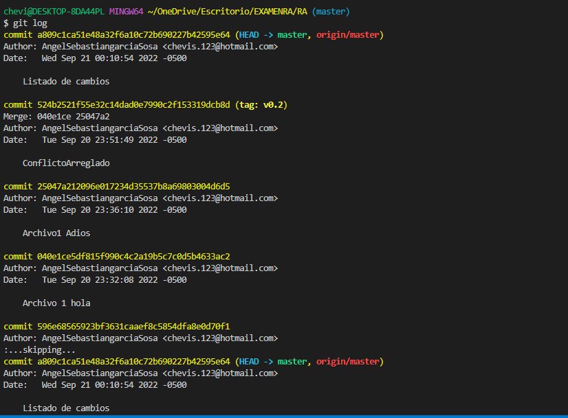

## EXamen Parte 2    

## Cuenta Gitbub
1. Poner una foto en tu perfil de GitHub. 
   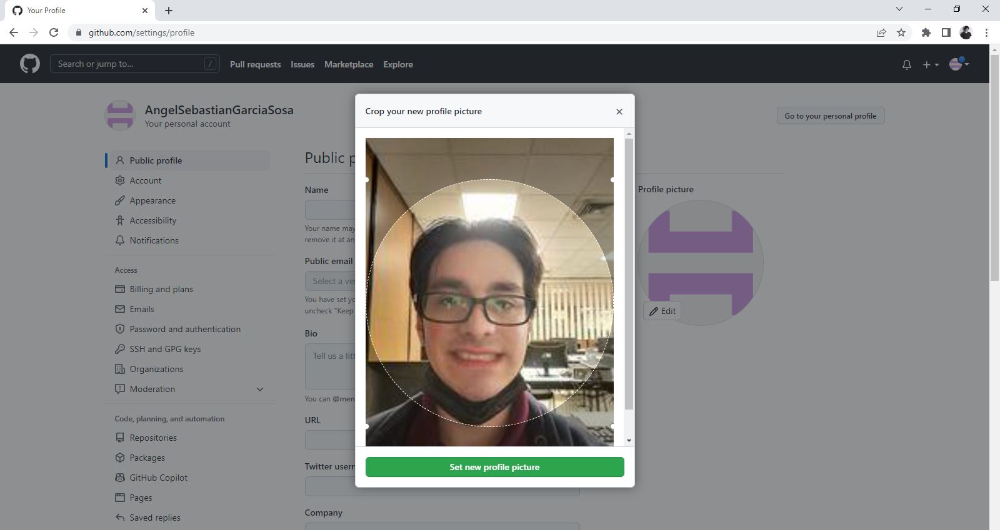
2. Poner el doble factor de autentificación en tu cuenta de GitHub. 
   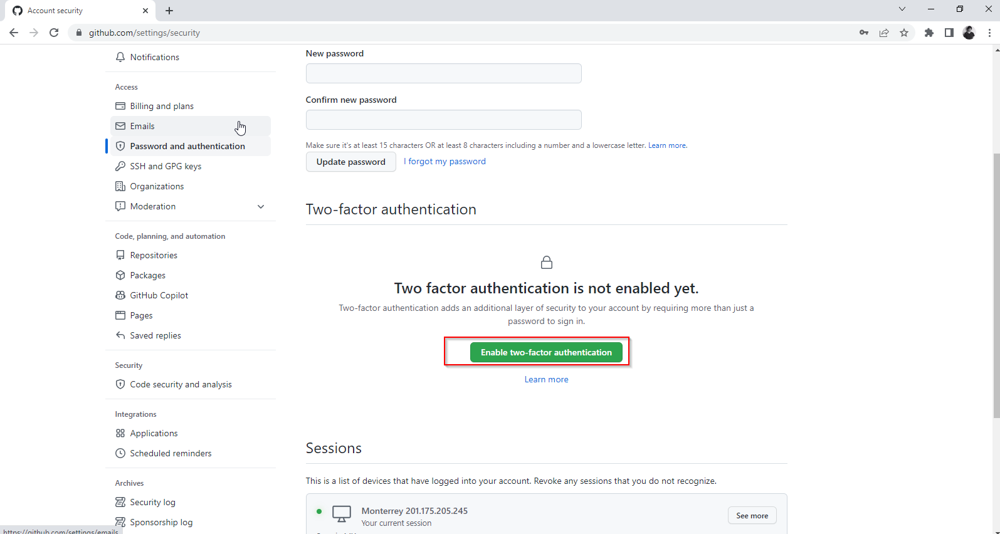
   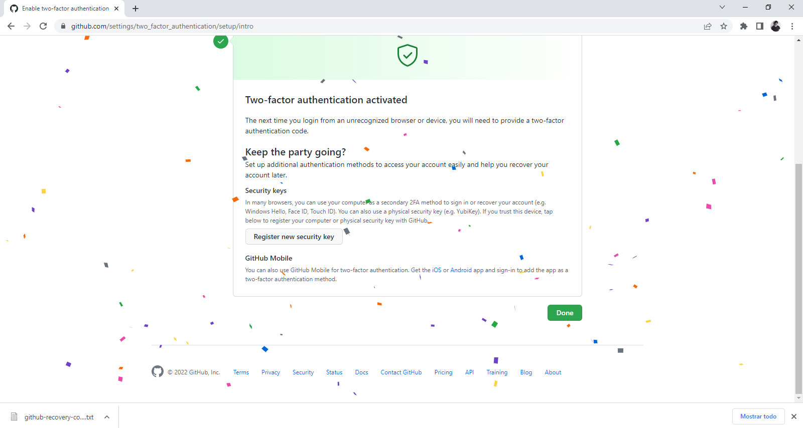
3. Añadir (si no lo has hecho aun) la clave pública (ssh) que se corresponde a tu equipo. 

## Uso social de github
1. Preguntar los nombres de usuario de GitHub de tus compañeros de clase, búscalos, y síguelos. 
   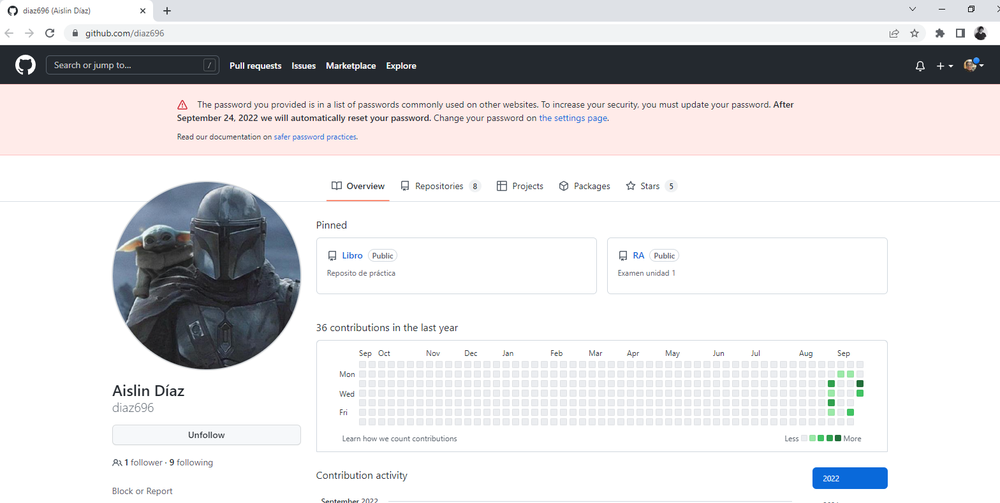
   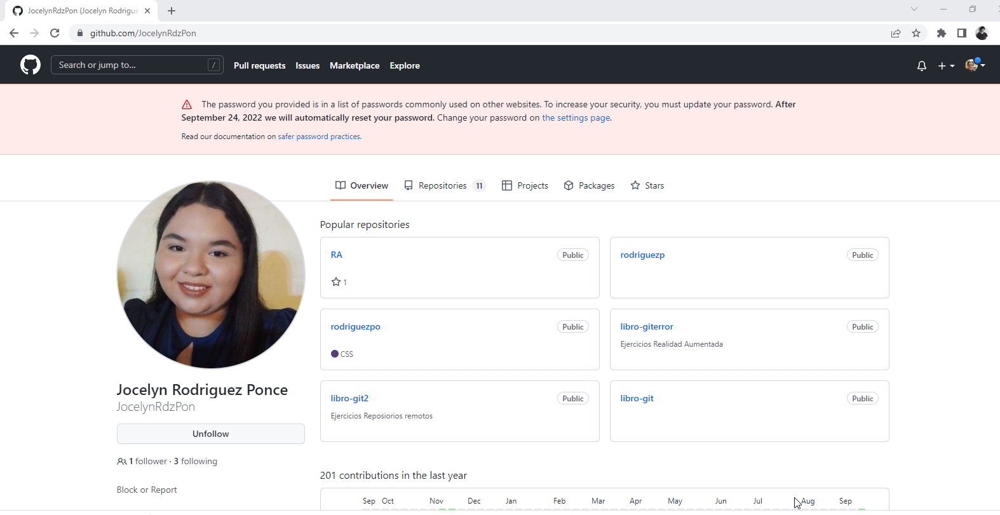
   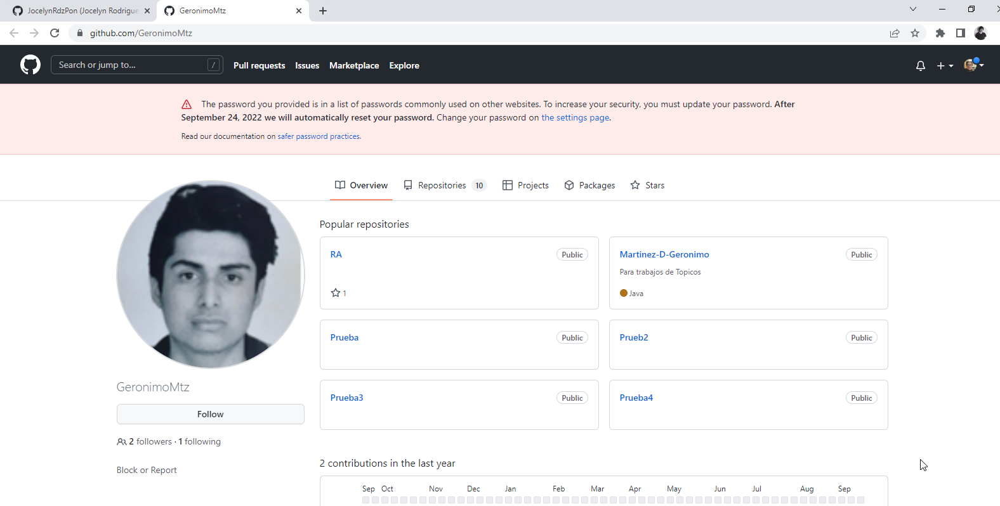
   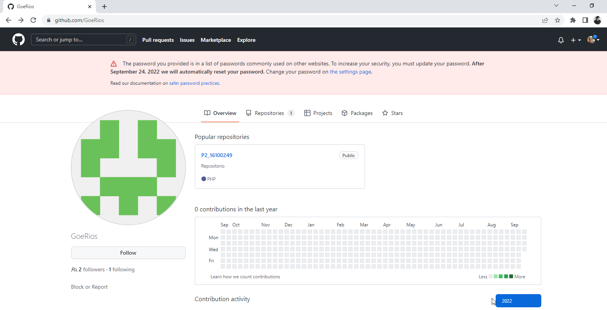
2. Seguir los repositorios RA del resto de tus compañeros. 
   
3. Añadir una estrella a los repositorios RA del resto de tus compañeros. 
 
 
 

## Crear una tabla  
| NOMBRE                        | GITHUB                                       |
| -------------                 | -------------                                | 
| AISLIN FERNANDA DIAZ AGUILAR  | https://github.com/diaz696                   |
| JOCELYN RODRIGUEZ PONCE       | https://github.com/JocelynRdzPon             |
| GERONIMO MARTINEZ DOMINGUEZ   |https://github.com/GeronimoMtz                |

## agregar colaborador
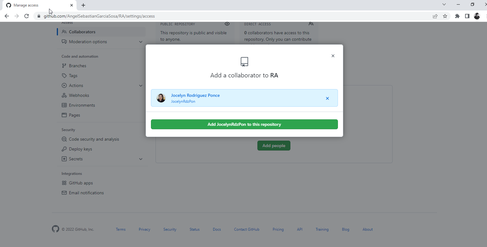
## Organizacion  
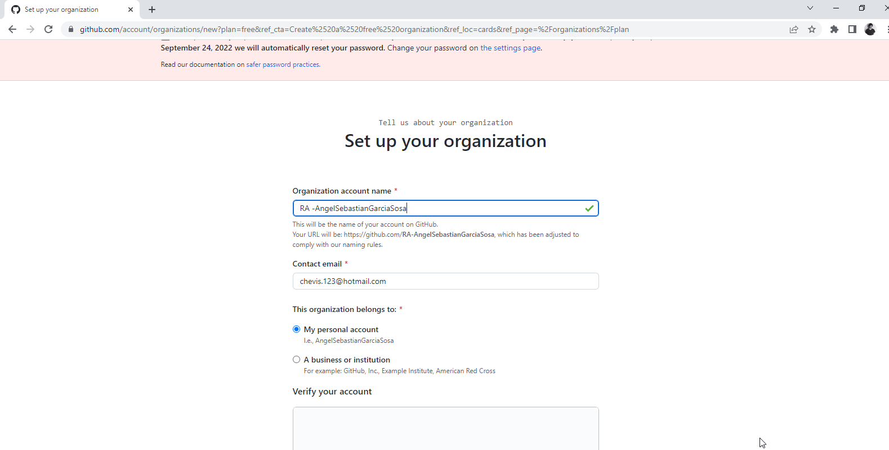
## crear equipo administradores  
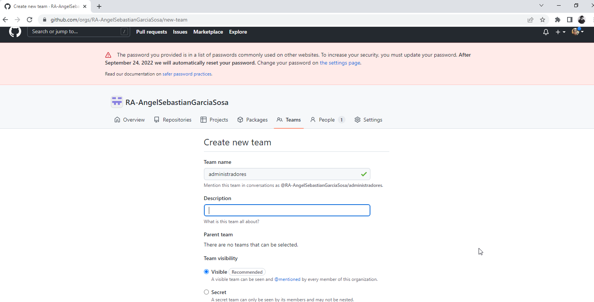

 

   
